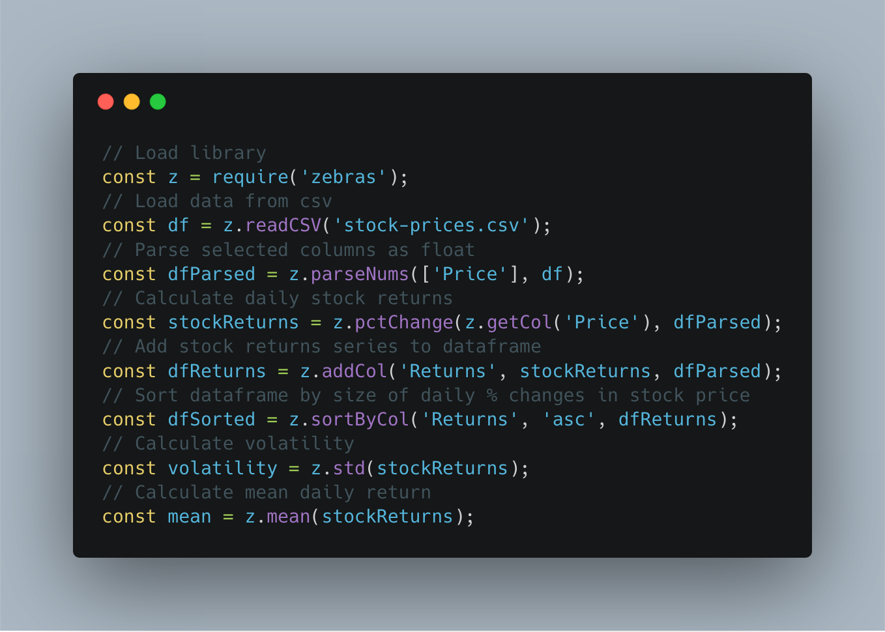

# zebras - data analysis library for javascript

<div align="center"></div>

Zebras is a data manipulation and analysis library written in JavaScript offering the convenience of pandas or R.

Zebras is especially useful for JS data analysis and visualization projects in notebooks on [ObservableHQ](https://beta.observablehq.com/) or using the [JS Jupyter kernel](https://github.com/n-riesco/ijavascript).

Unlike pandas, zebras is purely functional. All zebras functions accept data as an argument and return a new data structure transformed, and 'dataframes' are simply arrays of JS objects without any special methods.

Zebras is built on top of [Ramda](https://github.com/Ramda/ramda). Think of zebras as a collection of Ramda functions, and compositions of them, curated and repackaged for common data processing and data analysis tasks.

As in Ramda, all zebras functions are curried, making them easier to chain together. This means that, for example, `zebras.sortByCol(col, df)` is equivalent to `zebras.sortByCol(col)(df)`.

**An interactive introduction to the zebras library - using S&P 500 data - is available [as an Observable notebook](https://beta.observablehq.com/@nickslevine/introduction-to-zebras-a-data-analysis-library-for-javascr).**

**See the project roadmap on the zebras wiki [here](https://github.com/nickslevine/zebras/wiki/Zebras---Project-Roadmap).**

**A guide to using zebras in a JS Jupyter notebook can be found on the zebras wiki [here](https://github.com/nickslevine/zebras/wiki/Zebras-in-a-Jupyter-Notebook).**

## To Install

### Locally with Node / Jupyter

```sh
npm install zebras --save
```

```javascript
const z = require("zebras")
```

### Online in an Observable notebook

```javascript
z = require("https://bundle.run/zebras")
```

## Example Usage

```javascript
const z = require("zebras")
const data = z.readCSV("data.csv")
const parsedData = z.parseNums(["speed", "acc"], data)
const speed = z.getCol("speed", parsedData)
const avgSpeed = z.mean(speed)
```

Piping example:

```javascript
const z = require("zebras")
const avgSpeed = z.pipe([
  // array of functions for input to travel through
  z.readCSV,
  z.parseNums(["speed", "acc"]),
  z.getCol("speed"),
  z.mean,
])("data.csv")
```

## Documentation

[See the full documentation here.](http://zebrasjs.com/)
